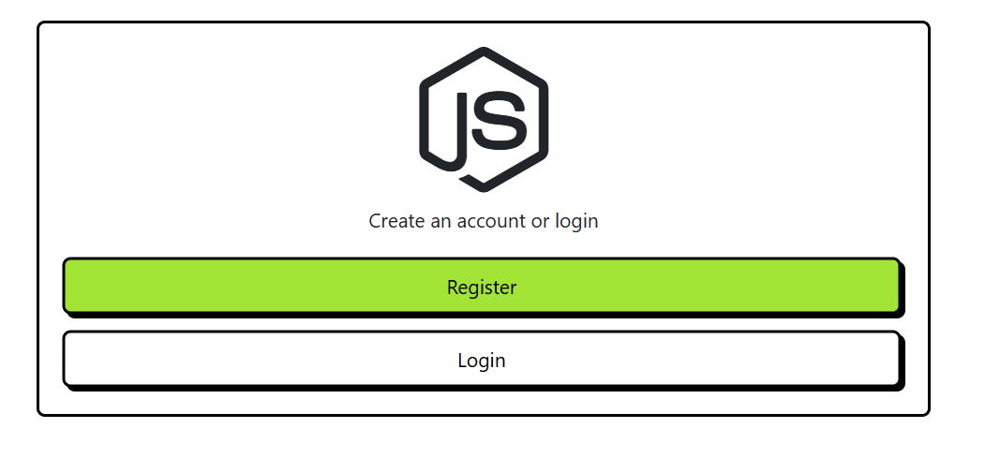
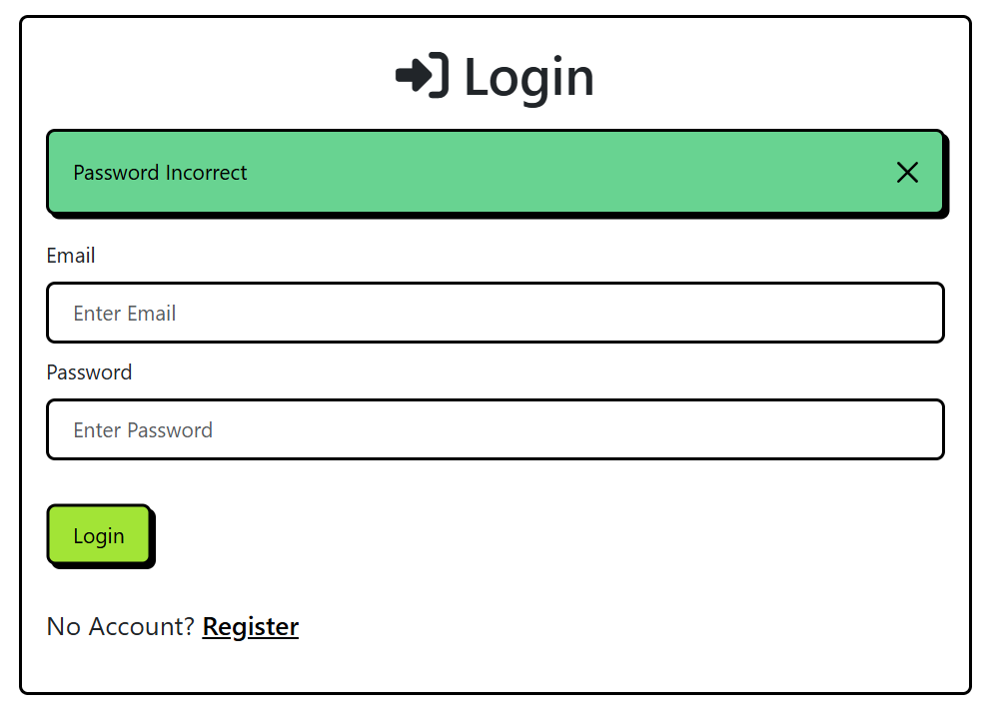
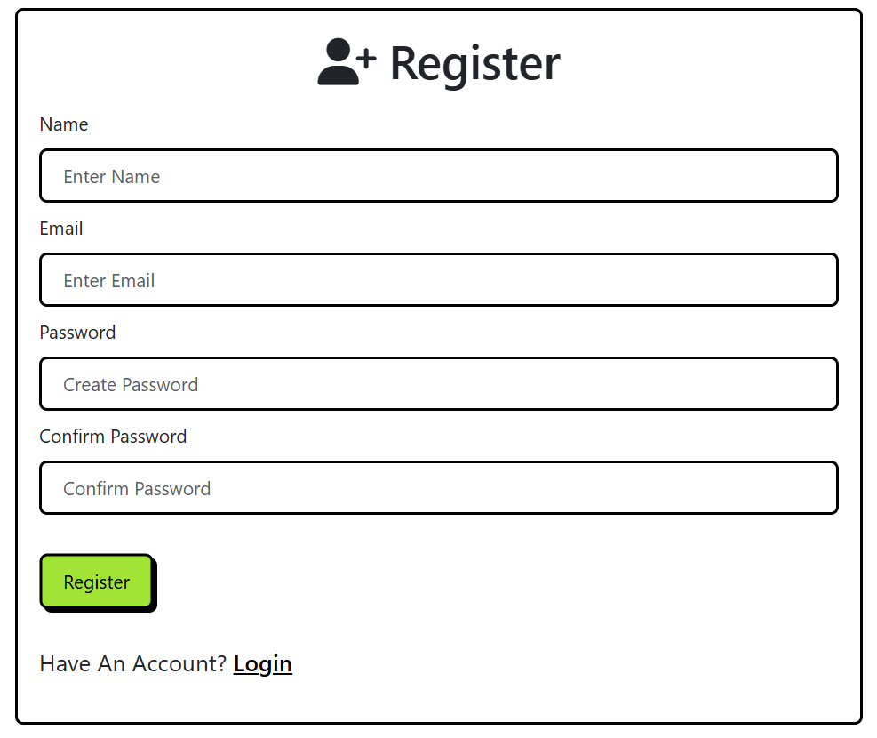
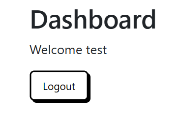

# Node.js Passport Authentication

A complete authentication system built with Node.js, Express, Passport, Mongoose, and EJS templating engine.

## Features

- User Registration & Login
- Password Hashing using bcryptjs
- Session Management with express-session
- Flash Messages for user feedback
- Protected Routes/Endpoints
- MongoDB Database Integration
- Responsive UI with Bootstrap
- EJS Templating

## Application Screenshots

### Welcome Page

*Landing page with options to register or login*

### Login Page

*User login interface with email and password fields*

### Registration Page

*New user registration form with validation*

### Dashboard
<br>
*Protected dashboard page showing user information*<>

## Prerequisites

Before running this project, make sure you have:

- Node.js (>= 18.0.0)
- MongoDB installed and running
- Git (optional)

## Installation

1. Clone the repository:
```bash
git clone https://github.com/yourusername/nodejs-with-passport-authentication.git
cd nodejs-with-passport-authentication
```

2. Install dependencies:
```bash
npm install
```

3. Create a `.env` file in the root directory:
```env
PORT=5000
MONGO_URI=your_mongodb_connection_string
```

4. Start the application:
```bash
# Development mode
npm run server

# Production mode
npm start
```

## Project Structure

```
├── config/
│   ├── auth.js         # Authentication middleware
│   ├── db.js          # Database configuration
│   └── configurePassport.js  # Passport configuration
├── models/
│   └── User.js        # User model schema
├── public/
│   └── css/           # Static CSS files
├── routes/
│   ├── index.js       # Main routes
│   └── user.js        # User authentication routes
├── views/
│   ├── layout.ejs     # Main layout template
│   ├── welcome.ejs    # Welcome page
│   ├── login.ejs      # Login form
│   ├── register.ejs   # Registration form
│   └── dashboard.ejs  # User dashboard
├── server.js          # Application entry point
└── package.json       # Project dependencies
```

## API Routes

### Public Routes
- `GET /` - Welcome page
- `GET /users/login` - Login page
- `GET /users/register` - Registration page
- `POST /users/register` - Register new user
- `POST /users/login` - Authenticate user

### Protected Routes
- `GET /dashboard` - User dashboard (requires authentication)
- `GET /users/logout` - Logout user

## Technologies Used

- **Express.js**: Web application framework
- **Passport.js**: Authentication middleware
- **Mongoose**: MongoDB object modeling
- **EJS**: Templating engine
- **Bootstrap**: Frontend framework
- **bcryptjs**: Password hashing
- **express-session**: Session management
- **connect-flash**: Flash messages
- **dotenv**: Environment variables
- **nodemon**: Development server

## Security Features

- Passwords are hashed using bcryptjs
- Session-based authentication
- Protected routes using custom middleware
- Flash messages for user feedback
- Input validation and sanitization

## Environment Variables

| Variable    | Description                  | Default     |
|------------|------------------------------|-------------|
| PORT       | Application port             | 5000        |
| MONGO_URI  | MongoDB connection string    | -           |

## Contributing

1. Fork the repository
2. Create your feature branch (`git checkout -b feature/amazing-feature`)
3. Commit your changes (`git commit -m 'Add some amazing feature'`)
4. Push to the branch (`git push origin feature/amazing-feature`)
5. Open a Pull Request

## License

This project is licensed under the MIT License - see the [LICENSE](LICENSE) file for details.

## Acknowledgments

- [Passport.js Documentation](http://www.passportjs.org/)
- [Express.js Documentation](https://expressjs.com/)
- [MongoDB Documentation](https://docs.mongodb.com/)
- [Bootstrap Documentation](https://getbootstrap.com/docs/)